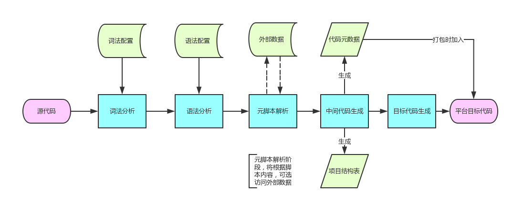

语法自扩展编译系统概要设计文档
===========================

### 一、写作目的

文本是可扩展编译系统的整体设计介绍文档，简要介绍了系统的适用场景、基本功能、产品特色、整体架构等。适合开发人员阅读。

### 二、整体定位

本编译系统是一款通用编程平台，面向的是系统编程领域。适用于跨平台的系统组件开发，原生应用开发，引擎开发等。
系统编程领域，主要由C和C++占据，最近虽然也有Rust、Go等新型语言介入，但整体上开发不够灵活，组件化较差，而Java等平台，又重度依赖虚拟机的部署，调用底层库时效率较低，这款编译系统就是在用编译器技术，实现跨平台的系统编程，又能提供更为灵活的实现。
主要希望解决的是系统开发中的灵活性差的问题。

### 三、基本功能

一款通用编程语言，可以进行基本的过程式开发。
可扩展编译器，能够在编译时指定编译的语法。
脚本化编译语言，能够在编译时期执行特定脚本代码控制编译流程，可以在编译时进行代码展开。
可以在编译时打印元数据，可以动态注册语法，也就是说，可以将语法做成库的形式引入。

### 四、产品特色

可扩展性和脚本化是最大的特色。
可扩展性主要体现在编译器可以在库中增加语法，而无需变动编译器，所有的语法描述的程序，最后都会被翻译为统一的S表达式，而库在新增语法时，只需要增加对S表达式的宏替换翻译即可实现，非常的方便。而S表达式是Lisp语言的精化，而且这种函数式编程能够非常轻松的扩展语法，Lisp是用宏实现的，我们这里定义了更直观的宏翻译语法，来实现类似的功能。
脚本的编译器非常灵活，您可以在编译期间指定您要用的文法，然后将来识别文法，驱动编译，而编译过程是脚本驱动的，虽然编译速度可能不快，但非常的灵活，您可以自由的修改编译脚本，然后执行，编译器虽然是脚本驱动，但核心代码都是C++完成的，其脚本仅仅是用来驱动的接口，效率也还可以接受。
	
### 五、目标平台

各主流桌面平台X86架构，Arm架构等通过LLVM平台实现。

### 六、整体架构

整体来看，系统的工作流程如下：

本系统分为如下几个部分，一个部分对应编译过程中的一趟或几趟：  
	词法分析器 - 语法分析器 - 元脚本执行器（语义分析） - 中间代码生成及优化器 - 目标代码生成器

1. 词法分析器  
	使用手工打造的词法分析程序，采用等价类映射来支持Unicode字符集。
	能够构建有限自动机来处理词法。
	内置预处理器，引导元脚本的解析

2. 语法分析器  
	语法分析器在元脚本解析前就开始了，语法分析器是整个系统的核心，首先加载默认的文法文件，一个EBNF范式的描述文件，为了加速，会自动为其构建缓存，下次便不会再次解析。

3. 元脚本执行器  
	提供元脚本的概念，这是一种编译时脚本，利用其API，可以轻松地控制编译流程，而且可以在编译期间进行相关内容的显示与内容生成，例如根据源代码中的类生成对应类名列表，或者根据其中的注解生成新的代码等。这些功能在一些接口类的生成上，非常有用。

4. 中间代码生成及优化器  
	这部分主要是利用LLVM的API将我们解析出来的语法树，转换成为通用的LLVM中间代码，这个代码不但可以和其他Clang、Haskell等平台生成的目标代码混合编译，还能统一地被LLVM的JIT编译器翻译执行。这个中间代码是可以输出的，并且能够用来做跨平台的发布。

5. 目标代码生成器  
	这部分十分简单，利用LLVM的API便可以轻松将中间代码转换为可执行的本机Native代码。

### 七、接口设计

#### 人机交互接口

采用命令行进行编译控制

#### 外部接口
	
系统提供可执行程序，动态连接库，静态连接库等形式供外部调用。  
本系统可以作为嵌入式脚本执行，提供C风格API供其他程序调用。  
本系统可以作为Lua库调用，利用so库载入，接入其lua接口动态连接库。  

#### 内部接口
	
各趟之间是C++的接口连接，采用的是多态工厂类的方式进行实现。

### 八、性能要求

不要求编译速度很快，但要求整体项目编译速度较快。
主要思路是尽量避免重复劳动，虽然编译速度不一定很快，但很少进行重复编译和大段代码的拷贝，所以希望采取类似Java的整体分析编译的思路，将编译好的代码和其元数据打包在一起，让元数据很容易被读取。

编译后的代码要求运行高效，兼顾安全，尽量考虑使用原生汇编代码。避免嵌套虚拟机和复杂的内存管理机制。主要目标是高效的调用已有的C/C++函数库。

### 九、内存管理

使用LLVM原生的内存管理  
暂时不使用垃圾回收机制，兼容C和C++的相互调用。  
采用可选扩展垃圾回收器，后期扩展再开发。  

### 十、设计原则和要求

1. 灵活优先，兼顾安全  
	首先保障一个系统能够实现该特性，其次保障这个特性少出问题。我希望提供尽可能多的方式来实现同样功能的代码，让开发人员可以选择对应的功能，而不是为了追求安全和效率，就不提供某些功能。

2. 重扩展性  
	即使一个功能目前没有，但一定保留能够实现它的手段。

3. 整体优化  
	不追求每个细节都十分完美和高效，但整体要保持平衡和容易让用户接受。

4. 最小化语言特性，最大化库扩展模型
	库相比于语言，更容易扩展，所以这也是重扩展性的一种手段，尽量将语言本身做的小巧精致，而扩展能力更加。

5. 模块化编程  
	语言原生支持模块化编程，而不需要依赖任何构建系统，对组件的支持是重中之重。

6. 稳定性和可测试性  
	本编译系统需要重视编译过程的稳定性，对于类似的代码，能够进行同样流程的编译工作。
	并且编译的每个pass都是可测试的，能够保障整个编译器稳定工作。对于超大超长源码也要能够支持。

